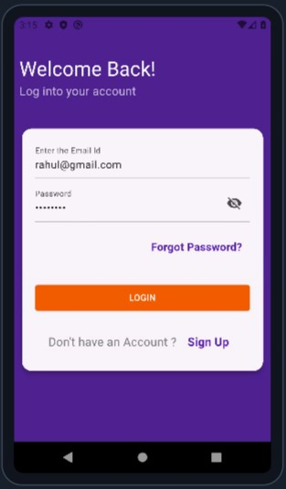
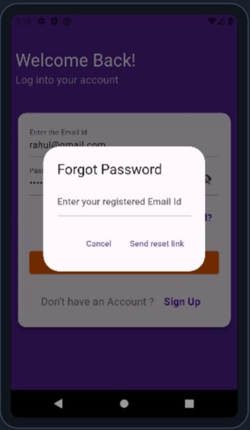
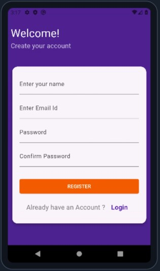
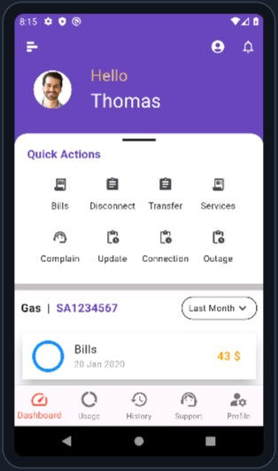
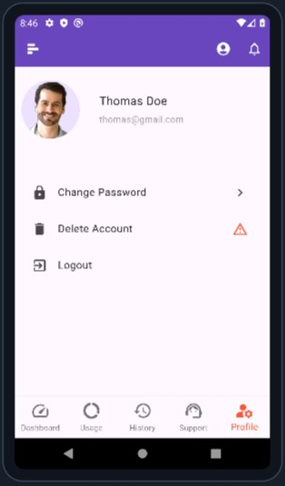

# Bynry Flutter Case Study


## Introduction

Bynry is gearing up to introduce a new feature to its SAAS product, necessitating
improvements to its existing mobile application. This application, crafted using Flutter,
serves the consumers of utility companies, enabling them to access a range of
functionalities from signing up and logging in to managing their accounts and paying
bills.
<br><br>
The primary goal of this assignment is to implement the necessary enhancements to
accommodate the new feature within the mobile application. You are expected to focus
on both the front-end and back-end aspects, ensuring a seamless user experience and
integration with the existing functionalities.

## Prerequisites

- [Flutter SDK Installation](https://flutter.dev/docs/get-started/install)
- A code editor or IDE with Flutter support (e.g., Visual Studio Code, Android Studio)

## Installation

1. Clone this repository:
    ```
    git clone https://github.com/Rahullkumr/bynry_casestudy_flutter.git
    ```
2. Navigate to the project directory:
    ```
    cd bynry_casestudy_flutter

    ```
3. Install dependencies:
    ```
    flutter pub get
    ```

## Running the Application

1. Connect a physical device or start an emulator:

    - Android Device: Enable USB debugging on your device and connect it to your computer.
    - Android Emulator: Launch the Android Studio emulator (if using Android Studio) or use a command-line emulator tool.
    - iOS Emulator: Launch the iOS Simulator or use a command-line emulator tool.

2. Run the app:
    ```
    flutter run
    ```
    > This will launch the application on your chosen device or emulator.

## Testing

1. Manual Testing:

    - Open the app on your chosen device or emulator.    
    - Interact with the login screen, including testing various inputs and scenarios (valid/invalid credentials, forgot password functionality).
    - Explore the existing dashboard functionalities (bill payment, account management, etc.).

## User Interface

|  |   | |
| -------------------------- | -------------------------- | -------------------------- |

|  |   | |
| -------------------------- | -------------------------- | -------------------------- |


<h1 align=center> Thank You! Happy Fluttering</h1>